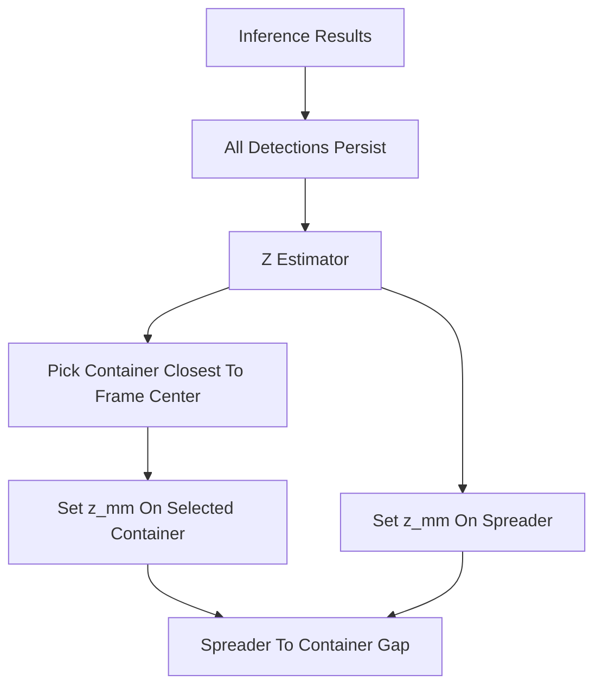

# Center Container Selection Plan

## Current Behavior

The backend Z estimator applies the calibrated model to every detection whose class is in `targets`:

```157:160:backend/app/services/z_estimator.py
    """Apply ``model`` to every detection whose class is in ``target_classes``.

    Modifies detection dicts in-place by adding a rounded ``z_mm`` field.
```

The frontend then chooses one detection per class for the side-view/gap UI using confidence or primary track, not image center:

```59:64:frontend/src/components/SideViewSchematic.tsx
function bestDetection(frame: InferenceResult | null, cls: string): SlotData {
  if (!cls || !frame) return { z: null, box: null }
  const dets = frame.detections.filter((d) => d.class_name === cls)
  if (dets.length === 0) return { z: null, box: null }
  const best = dets.reduce((a, b) => (a.confidence > b.confidence ? a : b))
```

This means once every container is detected, a side container can receive `z_mm` and become the container used for the spreader-to-container gap.

## Proposed Behavior

Use a per-frame selection rule for container target classes:

- Keep all raw detections in `result.json` and overlays.
- For each frame, for container target classes, choose the candidate whose bbox center is closest to the video center `(0.5, 0.5)`.
- Write/use `z_mm` only on that selected center container.
- Continue estimating spreader/reference class normally, because the spreader is already the object we compare against.
- Reuse the same center-selection rule in frontend fallbacks, especially for ByteTrack-smoothed frames where `z_mm` is intentionally recomputed from the box.



## Implementation Steps

1. Add backend center-selection helpers in [`backend/app/services/z_estimator.py`](backend/app/services/z_estimator.py):
   - `_center_distance_sq(det)` using normalized bbox center, so no video-size dependency is needed.
   - `_pick_center_detection(dets, class_name)` returning the target-class detection closest to `(0.5, 0.5)`.
   - Optionally annotate selected detections with a small metadata flag such as `z_role: "center_target"` or `z_selected: true` for debugging and UI clarity.

2. Update `estimate()` in [`backend/app/services/z_estimator.py`](backend/app/services/z_estimator.py):
   - For reference/spreader classes, keep existing “estimate all matching detections” behavior.
   - For configured container classes, estimate only the center-picked detection per frame.
   - Remove stale `z_mm` from non-selected container detections before writing results, so re-running calibration cannot leave old values on side containers.
   - Keep behavior unchanged for single-class mode with no target containers.

3. Decide how to identify “container target” classes:
   - Default: any target class whose name matches `/container/i` gets center-only treatment.
   - Keep spreader/reference unaffected even if it is auto-added to targets.
   - If we want this configurable later, store a `selection_policy` field in `z_calibration`, but start with convention-based detection to avoid UI churn.

4. Add frontend selection helper in [`frontend/src/lib/trackingPresentation.ts`](frontend/src/lib/trackingPresentation.ts):
   - `distanceToFrameCenter(det)`.
   - `pickCenterDetection(detections)`.
   - Possibly `isContainerClass(className)` so `SideViewSchematic`, `LiveDetectionReadout`, and graphs share the same rule.

5. Update display consumers:
   - [`frontend/src/components/SideViewSchematic.tsx`](frontend/src/components/SideViewSchematic.tsx): for the container slot, choose the center container instead of max-confidence. This is the critical spreader-distance fix.
   - [`frontend/src/components/LiveDetectionReadout.tsx`](frontend/src/components/LiveDetectionReadout.tsx): show center container values when multiple containers exist, to match the schematic.
   - [`frontend/src/components/HeightTimeline.tsx`](frontend/src/components/HeightTimeline.tsx): when plotting a container class, use the center container per frame so the Z graph follows the same physical target.
   - [`frontend/src/pages/TrackingComparePage.tsx`](frontend/src/pages/TrackingComparePage.tsx): update raw/ByteTrack labels from “best” to “center target” for container classes, while leaving other classes confidence/track based.

6. Update docs in the existing MkDocs guide [`docs/guides/z-axis-height-estimation.md`](docs/guides/z-axis-height-estimation.md):
   - Explain that multi-container videos select the container closest to the frame center for spreader/container distance.
   - Note that all detections remain visible, but only the center target participates in Z/gap estimation.
   - Mention the assumption: the camera should be framed so the intended pickup container is centered.

7. Add focused tests:
   - Backend unit tests for `z_estimator.estimate()` with three container detections: left, center, right; only the center container gets `z_mm`.
   - Regression test that spreader detections still get `z_mm` normally.
   - Frontend helper tests if this repo already has a TS test setup; otherwise rely on `npm run build` plus manual visual verification.

## Verification

- Run backend tests with `uv run pytest` or a focused `uv run pytest tests/...` if we add a new test file.
- Run frontend type/build check with `npm run build` from [`frontend`](frontend).
- Manual check on a multi-container inference result: all boxes should still render, but the side-view schematic and Z readouts should follow the centered container only.