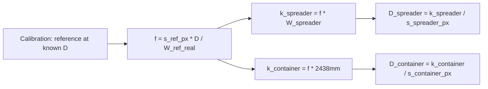

# Multi-Target Distance Estimation (Focal-Length Calibration)

## The Approach

The camera is fixed above, looking down. A **reference object** (e.g., spreader) with known real width is used to calibrate the camera's effective focal length `f`. Then `f` is used to estimate distance to **every configured target class** — including the reference object itself.




**Outputs per frame:** `z_mm` on every detection of every target class.

### Calibration (once)

The user provides:

- **Reference class name** — the class used for calibration labels (e.g., "spreader")
- **Reference real width** (mm) — the known physical width of that class
- **Size metric** — `w_px` (bbox width) or `h_px` (bbox height)
- **1+ calibration labels** — frames where the reference object is at a known distance
- **Targets** — list of `{class_name, real_width_mm}` to estimate distance for

Example targets:


| Class     | Real width (mm) | Notes                                     |
| --------- | --------------- | ----------------------------------------- |
| spreader  | 2500            | User-measured; also the reference         |
| container | 2438            | ISO standard, constant for 20ft/40ft/45ft |


The system computes `f` from the reference labels, then derives `k = f * real_width_mm` for each target.

### Runtime (every frame)

For each target class, for each detection of that class:

```
D = k_target / s_px
```

With 2+ calibration points, each target gets its own `linear_inv` model: `D = a_target / s + b_target`.

### Backward Compatibility

When no targets are configured (existing crane hook flow), the system behaves exactly as today: single class, `class_name` is both reference and target, no width scaling.

## Files to Change

### 1. [backend/app/services/z_estimator.py](backend/app/services/z_estimator.py)

**Add `_w_px` and `_get_size`** alongside existing `_h_px` (line 20):

```python
def _w_px(det: dict, video_width: int) -> float:
    return det["box"]["width"] * video_width

def _get_size(det: dict, video_resolution: dict, size_metric: str) -> float:
    if size_metric == "w_px":
        return _w_px(det, video_resolution["width"])
    return _h_px(det, video_resolution["height"])
```

**Refactor `calibrate()`** (line 25):

New signature:

```python
def calibrate(
    labels, frames, video_resolution,
    class_name="crane hook",           # reference class (for label lookup)
    size_metric="h_px",
    targets: list[dict] | None = None, # [{"class_name": str, "real_width_mm": float}]
    reference_real_width_mm: float | None = None,
) -> dict:
```

Logic:

- Build `(s, z_mm)` pairs from labels as today, using `_get_size` instead of `_h_px`.
- If `targets` is provided (multi-target mode):
  - Compute `f` from pairs: 1-point: `f = z_cal * s_cal / reference_real_width_mm`. 2+ points: fit on reference pairs, derive `f` from `a` coefficient.
  - For each target, compute `k = f * target.real_width_mm` (1-point) or scale `a` by `target.real_width_mm / reference_real_width_mm` (2+ points).
  - Return `{"type": "multi_target", "focal_length_px": f, "targets": [{"class_name": ..., "model": {"type": "k_over_s", "k": ...}}, ...]}`.
- If `targets` is None (legacy mode): existing `k_over_s` / `linear_inv` logic unchanged.

**Refactor `estimate()`** (line 108):

- If `model["type"] == "multi_target"`: loop over `model["targets"]`, for each run the existing per-detection loop with that target's `class_name` and sub-model.
- Otherwise: existing single-class logic, using `_get_size`.

**Update `apply_z_to_result()`** (line 179): read `targets`, `reference_real_width_mm`, `size_metric` from stored calibration and pass through.

### 2. [backend/app/api/inference.py](backend/app/api/inference.py) (line 739)

New request models:

```python
class ZCalibrationTarget(BaseModel):
    class_name: str
    real_width_mm: float

class ZCalibrationRequest(BaseModel):
    labels: list[ZCalibrationLabel]
    class_name: str = "crane hook"           # reference class
    size_metric: str = "h_px"
    reference_real_width_mm: float | None = None
    targets: list[ZCalibrationTarget] | None = None
```

Update `save_z_calibration` (line 807): persist all new fields. Stop hardcoding `"h_px"`.

### 3. [frontend/src/types/index.ts](frontend/src/types/index.ts) (line 303)

```typescript
export interface ZCalibrationTarget {
  class_name: string
  real_width_mm: number
}

export interface ZCalibration {
  labels: ZCalibrationLabel[]
  model: ZCalibrationModel | null
  class_name: string
  size_metric: string
  reference_real_width_mm?: number | null
  targets?: ZCalibrationTarget[] | null
  video_resolution?: { width: number; height: number }
}
```

### 4. [frontend/src/api/client.ts](frontend/src/api/client.ts) (line 415)

Extend `saveZCalibration` to accept and pass: `sizeMetric`, `referenceRealWidthMm`, `targets`.

### 5. [frontend/src/pages/ZCalibrationPage.tsx](frontend/src/pages/ZCalibrationPage.tsx)

Add to the right sidebar, above calibration points:

- **Size metric** toggle: `h_px` / `w_px`
- **Reference class** — text input (the class used for calibration labels)
- **Reference real width** (mm) — e.g. spreader width
- **Targets** — editable list of rows, each with class name + real width (mm). "Add target" button. Pre-populated with the reference class itself + a second row defaulting to 2438mm.

When reference width is blank, these fields are hidden and existing single-class behavior is used.

### 6. [frontend/src/components/ZCalibrationPanel.tsx](frontend/src/components/ZCalibrationPanel.tsx)

Same fields in compact layout.

### 7. [docs/guides/z-axis-height-estimation.md](docs/guides/z-axis-height-estimation.md)

Add "Reference-Object Calibration" subsection under "How Z Estimation Works":

- Focal-length derivation from a known-size reference object
- Multi-target estimation: one calibration, multiple output distances
- ISO container width (2.438m) is constant across 20ft/40ft/45ft
- Backward compatibility with the existing single-class flow

