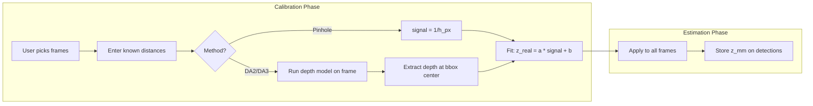
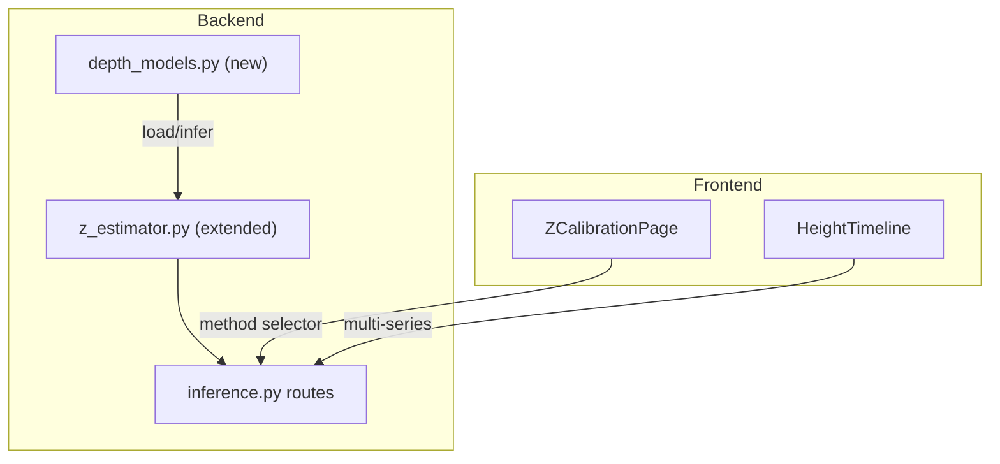

# Monocular Depth Model Z-Estimation (DA2 + DA3)

## How Calibration Works for Depth Models

The calibration UX is identical to the current pinhole flow -- the user picks frames at known distances. The difference is the **depth signal**:

- **Pinhole**: `signal = 1 / bbox_height_px` (geometric proxy)
- **DA2/DA3**: `signal = model_predicted_depth_at_bbox_center` (learned depth)

Both then fit the same linear mapping: `z_real = scale * signal + offset`.




For DA2/DA3, the depth model runs on the calibration frame image, produces a per-pixel depth map, and we sample the depth value at the center of the target detection's bounding box. This predicted depth replaces `1/bbox_height` as the input to the same linear regression.

Since DA2 and DA3 produce **relative** (not metric) depth, the calibration step is required -- the linear fit converts the model's internal depth scale to real millimeters. With 2+ calibration points, the offset term corrects for any systematic bias.

## Architecture




## Backend Changes

### 1. New service: `depth_models.py`

New file: [backend/app/services/depth_models.py](backend/app/services/depth_models.py)

Responsibilities:

- Load DA2-Small and DA3-Small models (via `torch.hub` for DA2, or `transformers` for both)
- Cache loaded models in memory (singleton pattern, like the existing inference runner)
- Run inference on a single frame: `image_path -> depth_map (H x W numpy array)`
- Extract depth at a given normalized (cx, cy) coordinate: sample the depth map at that pixel location
- Handle device selection using the existing `get_device()` from [src/core/trainer.py](src/core/trainer.py)

Model sources:

- **DA2-Small**: `torch.hub.load('LiheYoung/Depth-Anything-V2', 'depth_anything_v2_vits')` or via HuggingFace `transformers`
- **DA3-Small**: via HuggingFace `transformers` (`depth-anything/Depth-Anything-V3-Small`)
- Weights cached in `models/` directory (consistent with existing `.gitignore` patterns)

Key function signatures:

```python
def load_model(method: str, device: str = "auto") -> DepthModel:
    """Load and cache a depth model. method: 'da2' or 'da3'."""

def predict_depth(model: DepthModel, image_path: Path, device: str) -> np.ndarray:
    """Run depth inference. Returns HxW float32 depth map."""

def extract_depth_at_detection(depth_map: np.ndarray, det: dict, video_resolution: dict) -> float:
    """Sample depth map at the center of a detection's bounding box."""
```

### 2. Extend z_estimator.py

Modify: [backend/app/services/z_estimator.py](backend/app/services/z_estimator.py)

Changes:

- `calibrate()` gains an optional `depth_predictions` parameter: list of model-predicted depth values (one per calibration label), used instead of `1/h_px` when a depth model method is selected
- New model types: `"da2_linear"` and `"da3_linear"` stored alongside the existing `"k_over_s"` and `"linear_inv"`
- `estimate()` gains a `depth_values` parameter for depth-model-based estimation (pre-computed depth predictions for all frames)
- The calibration output stores the method name so the system knows how to re-estimate later

The calibration math for depth models:

```python
# pairs: [(d_pred, z_known_mm), ...]
# Fit: z_mm = a * d_pred + b  (OLS, same as existing linear_inv but on d_pred instead of 1/s)
```

### 3. Extend API routes

Modify: [backend/app/api/inference.py](backend/app/api/inference.py)

Changes:

- `ZCalibrationRequest` gains `method: str = "pinhole"` field (one of `"pinhole"`, `"da2"`, `"da3"`)
- `save_z_calibration` endpoint stores calibration under `z_calibrations` (plural, dict keyed by method) instead of the single `z_calibration` field. Backwards-compatible: reads old `z_calibration` as `{"pinhole": ...}`
- `apply_z_estimation` endpoint gains `method` query parameter. For `da2`/`da3`, it:
  1. Loads the depth model
  2. Runs depth inference on all frames with matching detections
  3. Applies the calibration mapping
  4. Stores results under `z_estimations.{method}` on each detection
- New endpoint `GET .../z-estimations` returns all method results for comparison
- Depth model estimation is potentially slow (~50ms/frame on GPU). Two options:
  - **Blocking** for small result sets (< 500 frames)
  - **Background task** for larger sets, with progress polling

The detection dict gains parallel fields:

```json
{
  "class_name": "crane hook",
  "z_mm": 15200.0,
  "z_methods": {
    "pinhole": 15200.0,
    "da2": 14850.0,
    "da3": 15050.0
  }
}
```

`z_mm` remains the "primary" estimate (from whichever method was run first or marked as primary), while `z_methods` holds all parallel results for comparison.

### 4. Model management

- Add DA2/DA3 model download to [Makefile](Makefile) `download-models` target
- Models are also auto-downloaded on first use via torch.hub/transformers cache
- Add `depth_model_device` setting to [backend/app/config.py](backend/app/config.py) (defaults to the existing `device` setting)

### 5. New dependency

Add `transformers` (for model loading) to [pyproject.toml](pyproject.toml). The `torch` and `torchvision` dependencies already exist.

## Frontend Changes

### 6. Extend types

Modify: [frontend/src/types/index.ts](frontend/src/types/index.ts)

- Add `ZEstimationMethod = 'pinhole' | 'da2' | 'da3'`
- `Detection` gains `z_methods?: Record<string, number>`
- `ZCalibration` gains `method: ZEstimationMethod`
- New type for the multi-calibration response

### 7. Extend ZCalibrationPage

Modify: [frontend/src/pages/ZCalibrationPage.tsx](frontend/src/pages/ZCalibrationPage.tsx)

- Add a method selector (segmented control or radio group) at the top of the sidebar: Pinhole | DA2 | DA3
- Each method has its own set of calibration points and model status
- The "Calibrate & Estimate" button sends the selected method
- Show model status per method (calibrated/not calibrated) in the sidebar
- When DA2 or DA3 is selected, show a note that estimation will take longer (runs a depth model on each frame)

### 8. Extend HeightTimeline for comparison

Modify: [frontend/src/components/HeightTimeline.tsx](frontend/src/components/HeightTimeline.tsx)

- Support `z_methods` data: if detections have `z_methods`, plot one line per method
- Each method gets a distinct color and label in the legend
- Tooltip shows all method values at a given timestamp
- Toggle individual method lines on/off via legend clicks

### 9. Extend InferencePage

Modify: [frontend/src/pages/InferencePage.tsx](frontend/src/pages/InferencePage.tsx)

- The Z-Axis Height Estimation card shows calibration status per method (e.g., "Pinhole: calibrated, DA2: not calibrated, DA3: calibrated")
- The timeline section uses the enhanced multi-series HeightTimeline

### 10. Extend API client

Modify: [frontend/src/api/client.ts](frontend/src/api/client.ts)

- `saveZCalibration` gains `method` parameter
- `applyZEstimation` gains `method` parameter
- New `getZEstimations` method for fetching all method results

## Documentation

### 11. Update MkDocs guide

Modify: [docs/guides/z-axis-height-estimation.md](docs/guides/z-axis-height-estimation.md)

- Add section on depth model methods (DA2, DA3)
- Explain the calibration process for depth models vs pinhole
- Include comparison guidance (when to use which method)
- Note the performance tradeoff (transformers are slower but may be more accurate)

## Performance Considerations

- **DA2-Small / DA3-Small**: ~25-50ms per frame on GPU, ~500ms on CPU
- For 1000 frames: ~25-50s on GPU (acceptable as blocking with progress), ~8 min on CPU (needs background job)
- Depth models only need to run on frames with matching detections (not every frame)
- Model weights: ~100MB per model, cached in `models/`
- GPU memory: ~200-400MB per model (small variants)
- Models are loaded lazily on first use and cached in memory for the session

