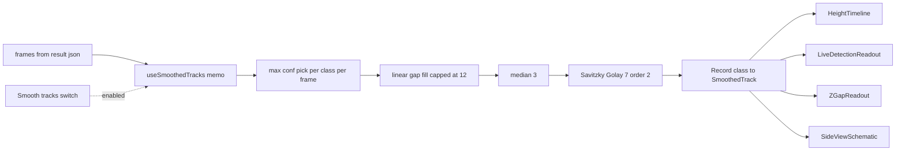

# Detection Smoothing (Frontend Only)

## Problem

`result.json` frames carry noisy, sometimes-missing detections. The UI consumers — [HeightTimeline.tsx](frontend/src/components/HeightTimeline.tsx), [LiveDetectionReadout.tsx](frontend/src/components/LiveDetectionReadout.tsx), [ZGapReadout.tsx](frontend/src/components/ZGapReadout.tsx), [SideViewSchematic.tsx](frontend/src/components/SideViewSchematic.tsx) — each reinvent a class picker and none smooth or interpolate. Symptoms: gaps in the timeline, jittery bbox sizes, and that jitter propagates into the client-side `z = f·W/s` estimate.

## Algorithm

`frames[]` is loaded up front, so we can run an offline, two-sided filter — no lag, no causality trade-off.

Per class `c`, per field `f ∈ {box.x, box.y, box.width, box.height, z_mm}`:

1. **pickMaxConfPerFrame** → 1:1 series aligned with `frames[]` (null where the class is absent).
2. **interpolateGapsLinear(maxGap = 12)** → fills null runs ≤ 12 frames (≈0.4–0.5 s) by linear interp between real anchors; tagged `'interpolated'`. Bigger gaps stay null.
3. **medianFilter1D(window = 3)** → kills single-frame spikes.
4. **savitzkyGolay1D(window = 7, order = 2)** → edge-preserving low-pass; preserves hoist acceleration curvature. Boundary frames use a truncated-asymmetric window (no mirror padding).

## Return shape

```ts
interface SmoothedPoint {
  box: BoundingBox
  z_mm: number | null
  confidence: number | null
  source: 'measured' | 'interpolated'
}
type SmoothedTrack = Array<SmoothedPoint | null>
```

Exposed via `useSmoothedTracks(frames, classes, { enabled })` returning `Record<string, SmoothedTrack>`. When `enabled === false`, returns raw max-confidence picks with no interp/filter so consumers have one code path.

## Flow



## Files to add

- **frontend/src/lib/smoothing.ts** — pure functions, no React. Exports `pickMaxConfidencePerFrame`, `interpolateGapsLinear`, `medianFilter1D`, `savitzkyGolay1D`, `smoothTrack`. Sav-Golay is ~40 lines (Vandermonde + weights), no new npm dep.
- **frontend/src/hooks/useSmoothedTracks.ts** — memoised hook over `frames` + `classes` + `enabled`; JSDoc header documents the single-instance-per-class assumption.

## Files to touch

- **[HeightTimeline.tsx](frontend/src/components/HeightTimeline.tsx)** — replace `frame.detections.find(...)` with `smoothed[targetClass][frameIdx]`.
- **[LiveDetectionReadout.tsx](frontend/src/components/LiveDetectionReadout.tsx)** — replace `filter + reduce` with smoothed lookup; small `(smoothed)` header badge when toggle is on.
- **[ZGapReadout.tsx](frontend/src/components/ZGapReadout.tsx)** — read smoothed `z_mm` for both slots.
- **[SideViewSchematic.tsx](frontend/src/components/SideViewSchematic.tsx)** — swap `bestDetection` for a smoothed lookup; existing client-side-Z path unchanged, just sees a steadier `s`.
- **[InferencePage.tsx](frontend/src/pages/InferencePage.tsx)** — `useState` for the flag, render one `Switch` labelled "Smooth tracks" (default on), run the hook once, pass tracks down.

## Defaults (constants in `smoothing.ts`)

- `MAX_GAP_FRAMES = 12`
- `MEDIAN_WINDOW = 3`
- `SG_WINDOW = 7`, `SG_ORDER = 2`
- Toggle default: on

## Non-goals

- Zero backend changes; no touches to [inference_runner.py](backend/app/services/inference_runner.py), [z_estimator.py](backend/app/services/z_estimator.py), or the persisted schema.
- No tracker IDs required; single-instance-per-class.
- No new npm deps.

## Edge cases

- Boundary frames: truncated-asymmetric Sav-Golay (no invented curvature from mirror padding).
- No extrapolation past first/last real anchor.
- Classes seen only once: filter collapses to identity.
- `z_mm` smoothed independently; a frame can carry a smoothed box with null z.

## Verification

- `npx tsc --noEmit` and ReadLints clean.
- Manual smoke on the current noisy video: timeline gaps bridged, schematic widths stable, `ZGapReadout` stops flickering. Toggle off to confirm fallback matches today's output.
