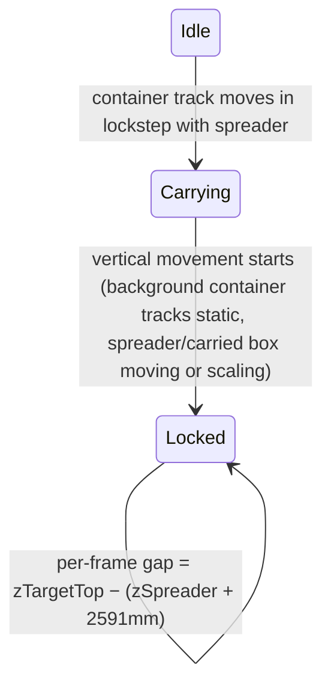

# Loaded-Spreader Stacking Distance

## Context

Today the frontend computes the empty-spreader gap from smoothed ByteTrack frames: pinhole Z from bbox size (`computeZForBox` in [frontend/src/lib/zCalibration.ts](frontend/src/lib/zCalibration.ts)) and `zContainerTop - zSpreader` in [frontend/src/components/SideViewSchematic.tsx](frontend/src/components/SideViewSchematic.tsx). The new feature runs in the same place, but needs **all** container tracks, so it operates on `smoothedTrackedFrames` in [frontend/src/pages/InferencePage.tsx](frontend/src/pages/InferencePage.tsx) — *before* `pickPrimaryTrackPerClassFrames` collapses containers to the center one.

## New module: `frontend/src/lib/stackingDistance.ts`

Pure functions over the smoothed tracked frames (chronological, causal — same style as `oneEuroFilter.ts`), producing one analysis result for the whole run that the playback UI indexes by frame.

1. **Carried-container detection (auto, motion-based).** Per frame, over a trailing window (~1s): a container track is "carried" when (a) its box overlaps the spreader box (spreader center inside container box or high overlap), and (b) its center-velocity closely matches the spreader's center-velocity. Track the winner with hysteresis so the flag doesn't flicker.

2. **Vertical-movement-start (lock) detection.** Per frame compute:
   - *Background motion*: median per-frame displacement of all container tracks except the carried one (normalized units/s). These are static world objects, so they only move on screen when the trolley/camera moves horizontally.
   - *Spreader motion*: spreader bbox center displacement plus bbox scale-change rate (size growth = descending under a fixed camera).
   - **Lock trigger**: background motion below a small epsilon sustained for ~1s AND spreader motion/scale-change above threshold — i.e. "surroundings don't move, only the spreader moves", exactly as requested. Thresholds live as exported constants so they are tunable.

3. **Target selection at lock.** At the trigger frame, among container tracks excluding the carried one, pick the track whose center is nearest the frame center (reuse `distanceToFrameCenter` from [frontend/src/lib/trackingPresentation.ts](frontend/src/lib/trackingPresentation.ts)). Lock its `track_id` for the rest of the run.

4. **Frozen target Z.** Compute the target's Z as the median of `computeZForBox` over a short window around the lock frame, then freeze it. The target container is static and the camera has stopped moving horizontally, so its true Z no longer changes — freezing makes the estimate immune to the growing occlusion from the descending carried container. Fall back to live per-frame Z only if the frozen value is unavailable.

5. **Per-frame stacking gap** (after lock):
   - `zSpreader` — live, from the spreader bbox (same as today, incl. round-feature proxy handling).
   - Carried-container bottom = `zSpreader + ISO_CONTAINER_HEIGHT_MM` (2591, the constant already in `SideViewSchematic`).
   - **Remaining drop = frozen `zTargetTop` − (`zSpreader` + 2591)**.

Output shape: `{ carriedTrackIdByFrame, lockFrameIndex, targetTrackId, targetZMm, gapMmByFrame, stateByFrame }`.

## UI changes

- **[frontend/src/pages/InferencePage.tsx](frontend/src/pages/InferencePage.tsx)**: run the analysis in a `useMemo` on `smoothedTrackedFrames`; pass the result to the overlay builder and schematic.
- **Overlay** ([frontend/src/lib/trackingPresentation.ts](frontend/src/lib/trackingPresentation.ts) / `buildTrackedOverlayBoxes`): when locked, additionally draw the locked target container's box in a distinct color with a "target" label; label the carried container box "carried". (These extra boxes are added alongside the existing primary-track boxes.)
- **[frontend/src/components/SideViewSchematic.tsx](frontend/src/components/SideViewSchematic.tsx)**: accept the stacking result as an optional prop. When locked, render stacked mode — carried container drawn attached beneath the spreader, target container drawn at the frozen Z, and an amber dimension bracket showing the remaining drop (carried bottom → target top) instead of the empty-spreader gap. Before lock, keep current behavior and show a small "carrying — waiting for vertical movement" status line when a carried container is detected.

## Docs

Per the workspace mkdocs rule: extend [docs/guides/z-axis-height-estimation.md](docs/guides/z-axis-height-estimation.md) with a "Stacking distance with a loaded spreader" section (carried detection, lock-on-vertical-movement rule, frozen target Z, gap formula). No new doc files, no nav change needed.

## Not in scope

- No backend/`result.json` changes and no exported-video overlay changes — matching how the current empty-spreader gap is frontend-only.
- No new detector classes; carried state is inferred from motion, as chosen.