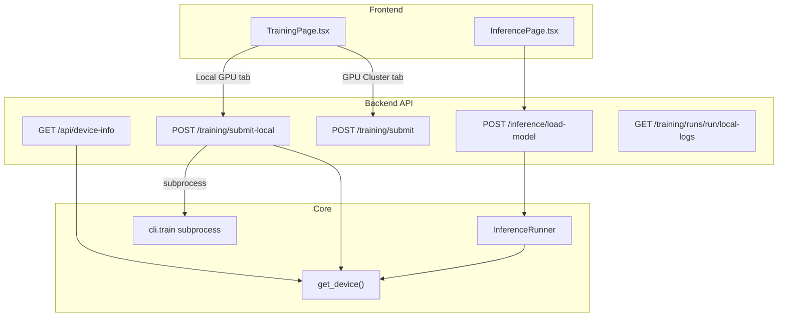

# Add Local GPU Training/Inference Support

## Current State

- **CLI**: Both `cli/train.py` and `cli/inference.py` already accept `--device auto/cuda/mps/cpu`. The `get_device()` function in `src/core/trainer.py` auto-detects CUDA. **No CLI changes needed.**
- **Training UI**: Only supports remote GPU cluster (SLURM). No way to run training locally.
- **Inference UI**: Has "Local" and "GPU Cluster" tabs, but the backend `InferenceRunner` never sets a device on the model -- it uses whatever default the model library picks.
- **Backend config**: `device` defaults to `"mps"` (Mac-specific), should be `"auto"`.

## Architecture

## Changes

### 1. Backend: Device detection endpoint + config fix

**[backend/app/config.py](backend/app/config.py)**: Change default `device` from `"mps"` to `"auto"`.

**New endpoint** `GET /api/device-info` in a new or existing router:

- Calls `get_device("auto")` and `get_device_info()` from `src/core/trainer.py`
- Returns `{ device: "cuda", name: "NVIDIA RTX ...", memory_gb: 24.0 }` (or `cpu`/`mps`)
- Used by both Training and Inference pages to show GPU status

### 2. Backend: Local training subprocess

**[backend/app/api/training.py](backend/app/api/training.py)**: Add `POST /projects/{project_name}/training/submit-local` endpoint:

- Accepts a `LocalTrainingSubmitRequest` (training params, data config -- no GPU/SLURM config)
- Exports the dataset first (reuses existing `export_dataset` logic)
- Launches `python -m cli.train --project {path} --device auto ...` as a background subprocess
- Captures stdout/stderr to a log file in the run directory
- Creates `meta.json` with `gpu_type: "local"` and tracks the PID
- Returns `{ run_name, pid, message }`

**[backend/app/api/training.py](backend/app/api/training.py)**: Add `GET /projects/{project_name}/training/runs/{run_name}/local-logs` endpoint:

- Streams the local log file via SSE (similar to SLURM log streaming)
- Reads from `{run_dir}/training.log`

**[backend/app/api/training.py](backend/app/api/training.py)**: Update cancel endpoint to handle local processes (kill by PID).

### 3. Backend: Inference device support

**[backend/app/services/inference_runner.py](backend/app/services/inference_runner.py)**: Update `load_model()` to:

- Accept a `device` parameter (default `"auto"`)
- After loading the model, move it to the resolved device (`model.to(device)` or rfdetr equivalent)

**[backend/app/api/inference.py](backend/app/api/inference.py)**: Update `load_model` endpoint to pass device from settings/auto-detection to `inference_runner.load_model()`.

### 4. Backend: Pydantic models

**[backend/app/models/training.py](backend/app/models/training.py)**: Add `LocalTrainingSubmitRequest` model:

- `label: Optional[str]`
- `training: TrainingConfig` (reuse existing)
- `data: DataConfig` (reuse existing)
- `infer_after: bool = False`
- `infer_test_only: bool = False`

### 5. Frontend: Training page -- add Local GPU mode

**[frontend/src/pages/TrainingPage.tsx](frontend/src/pages/TrainingPage.tsx)**:

- Add mode toggle tabs: "Local GPU" / "GPU Cluster" (similar to inference page pattern)
- In "Local GPU" mode:
  - Show detected device info (from `GET /api/device-info`)
  - Hide GPU cluster config (gpu_type, num_gpus, time_limit, SLURM-specific stuff)
  - Keep: model size, epochs, batch size, learning rate, image size, data source config, advanced options
  - Submit button calls `submit-local` endpoint instead of `submit`
- In "GPU Cluster" mode: Keep existing behavior unchanged
- Update log viewer to work with local logs endpoint for local runs

### 6. Frontend: Inference page -- show device info

**[frontend/src/pages/InferencePage.tsx](frontend/src/pages/InferencePage.tsx)**:

- In "Local" mode, show the detected device info (e.g., "Running on NVIDIA RTX 4090")
- No other significant changes needed (local inference already works, just needs device passthrough)

### 7. Frontend: Types + API client

**[frontend/src/types/index.ts](frontend/src/types/index.ts)**: Add `DeviceInfo` interface and `LocalTrainingSubmitRequest` interface.

**[frontend/src/api/client.ts](frontend/src/api/client.ts)**: Add API methods:

- `device.getInfo()` -> `GET /api/device-info`
- `training.submitLocal(projectName, request)` -> `POST /projects/{name}/training/submit-local`
- `training.streamLocalLogsUrl(projectName, runName)` -> URL for local log SSE

### Files to modify (summary)

- `backend/app/config.py` -- change default device
- `backend/app/api/training.py` -- add local submit + local logs endpoints
- `backend/app/api/inference.py` -- pass device to model loading
- `backend/app/models/training.py` -- add LocalTrainingSubmitRequest
- `backend/app/services/inference_runner.py` -- accept device param
- `backend/app/main.py` -- register device-info route (if new router)
- `frontend/src/types/index.ts` -- add new types
- `frontend/src/api/client.ts` -- add new API methods
- `frontend/src/pages/TrainingPage.tsx` -- add Local GPU mode tab
- `frontend/src/pages/InferencePage.tsx` -- show device info in local mode

