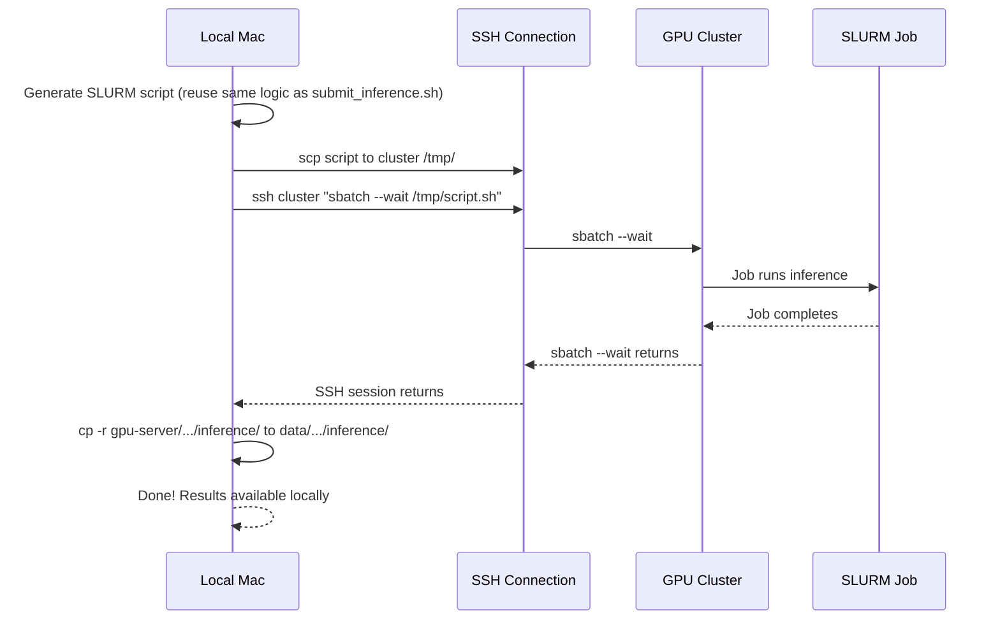

# Local Inference + Auto-Sync Script

## Approach

Create a new **local-only** script `run_inference.sh` that does everything end-to-end from the Mac. `submit_inference.sh` stays untouched on the cluster for direct use.



## New file: `run_inference.sh`

This script:

1. **Accepts the same args as `submit_inference.sh`** (--project, --run/--latest, --video, --gpu, etc.) so the UX is identical
2. **Generates the same SLURM script** -- reuse the exact same heredoc/template logic from [submit_inference.sh](submit_inference.sh) (lines 189-256)
3. **Copies script to cluster**: `scp "$SLURM_SCRIPT" $SSH_HOST:/tmp/`
4. **Submits and waits**: `ssh $SSH_HOST "sbatch --wait /tmp/$SCRIPT_NAME"` -- blocks until job completes, no polling needed
5. **Checks exit code**: `sbatch --wait` returns the job's exit code, so we can detect failure
6. **Syncs results**: On success, copies from SSHFS mount to local:

```
   SRC=gpu-server/$PROJECT/inference/
   DST=$PROJECT/inference/
   mkdir -p "$DST"
   cp -r "$SRC" "$DST"


```

1. **Cleans up**: Removes the temp script from the cluster

### SSH connection details (from existing scripts)

- Host: `youngjin@xlogin.comp.nus.edu.sg` (from [mount_gpu.sh](mount_gpu.sh) and [sync.sh](sync.sh))
- Remote batman dir: `/home/y/youngjin/batman`
- SSHFS mount: `gpu-server/` (relative to project root)
- Uses SSH ControlMaster like [sync.sh](sync.sh) for efficient connection reuse

### Sync scope

Only sync the **specific run's inference output**, not the entire inference directory:

```
gpu-server/$PROJECT/inference/$RUN_NAME/ -> $PROJECT/inference/$RUN_NAME/
```

This avoids copying old inference runs and keeps it fast. We know the exact `$RUN_NAME` because we resolved it in the script (same logic as submit_inference.sh lines 161-165).

### Key considerations

- **SSHFS mount check**: Verify `gpu-server/` is mounted before attempting sync; if not, print a message suggesting `./mount_gpu.sh`
- `**sbatch --wait` exit code: Returns 0 on success, non-zero on failure. Skip sync on failure and show the SLURM error log path
- **Large files**: `detected.mp4` files are ~7-15MB each. `cp` from SSHFS is fine for this size.
- `**--dry-run`: Forward to the SLURM script generation (show what would be submitted, don't SSH)
- `**--no-sync`: Optional flag to submit and return immediately without waiting (equivalent to current behavior)
- **Streaming output**: Use `ssh -t` or tail the SLURM log via SSHFS mount so the user can see inference progress while waiting

### Differences from `submit_inference.sh`

| Aspect           | `submit_inference.sh` (cluster) | `run_inference.sh` (local)        |
| ---------------- | ------------------------------- | --------------------------------- |
| Where it runs    | On the cluster                  | On the Mac                        |
| How sbatch works | Direct `sbatch` call            | `ssh cluster "sbatch --wait ..."` |
| Blocking         | Returns immediately             | Blocks until job done             |
| Sync             | None                            | Auto-copies results locally       |
| Still needed?    | Yes, for direct cluster use     | New addition                      |

## Changes to docs

Update mkdocs to document `run_inference.sh` as the recommended local workflow.
