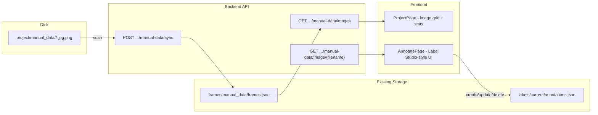

# Manual Data Annotation UI

## Context

Currently, the Batman workflow is: upload video -> extract frames -> auto-label with SAM3 -> correct annotations -> train. The user wants to switch to: place images in `manual_data/` folder -> annotate with bounding boxes in a Label Studio-like UI -> train.

The existing annotation infrastructure (normalized center-format bounding boxes in `labels/current/annotations.json`, frame IDs, class management) will be fully reused. The `manual_data/` images will be registered as frames under a `manual_data` source key, fitting cleanly into the existing data model.

## Architecture



## Backend Changes

### 1. New `manual_data` API router ([backend/app/api/manual_data.py](backend/app/api/manual_data.py) - new file)

Add a new router mounted at `/api/projects/{project_name}/manual-data` with endpoints:

- `**POST /sync**` - Scans `<project_path>/manual_data/` for image files (jpg, jpeg, png, webp, bmp). For each image, reads dimensions (via Pillow), creates an entry in `frames/manual_data/frames.json` with `image_path` pointing to the actual file in `manual_data/`. Preserves existing entries for files that haven't changed. Returns summary of images found/added/removed.
- `**GET /images**` - Lists all manual_data images with annotation counts per image (cross-referencing `annotations.json`). Supports pagination. Returns `{total, images: [{filename, frame_id, width, height, annotation_count, url}]}`.
- `**GET /image/{filename}**` - Serves an image file directly from `manual_data/` via `FileResponse`.

### 2. Register the router ([backend/app/main.py](backend/app/main.py))

```python
from backend.app.api import manual_data
app.include_router(manual_data.router, prefix="/api")
```

### 3. Auto-sync on project load

In the project `GET` endpoint or as a hook, optionally auto-sync the `manual_data/` folder if it exists, so the UI always shows current state without requiring a manual sync button press.

## Frontend Changes

### 4. Add API client methods ([frontend/src/api/client.ts](frontend/src/api/client.ts))

Add `manualData` namespace:

- `sync(projectName)` -> POST `/manual-data/sync`
- `listImages(projectName, offset?, limit?)` -> GET `/manual-data/images`
- `imageUrl(projectName, filename)` -> string URL for image

### 5. Rewrite ProjectPage ([frontend/src/pages/ProjectPage.tsx](frontend/src/pages/ProjectPage.tsx))

**Remove:**

- Video upload section (file input, `Upload Video` button, `VideoCard` component)
- Video list with extract frames / annotate per-video flow
- Roboflow import section and form
- Imported datasets gallery section

**Replace with:**

- **"Images" card** showing a grid of thumbnails from `manual_data/` with:
  - Image count and annotation progress (e.g., "42/100 annotated")
  - A "Refresh" button that calls `/manual-data/sync`
  - Thumbnail grid (4-5 columns) with each image showing a small green/gray dot indicating whether it has annotations
  - A prominent "Annotate" button linking to the annotation page
  - Empty state: instructions telling the user to place images in the `manual_data/` folder
- Keep existing sidebar sections: Classes management, Inference results

### 6. Rewrite AnnotatePage ([frontend/src/pages/AnnotatePage.tsx](frontend/src/pages/AnnotatePage.tsx))

Redesign to follow Label Studio patterns:

**Remove:**

- Video selector dropdown in sidebar
- Auto-Label button and SAM3 integration
- Video-specific frame timeline

**New layout (similar to Label Studio):**

```
+----------------------------------------------+----------+
|                                               | Classes  |
|           Image + Canvas                      | (1-9)    |
|           (draw bounding boxes)               |----------|
|                                               | Regions  |
|                                               | (list)   |
+----------------------------------------------+----------+
| < Prev |  12 / 100  | Next > | [thumbnails strip...]    |
+----------------------------------------------+----------+
```

- **Image navigation**: Replace video-based navigation with image-based. Left/right arrows cycle through images. Show "N / total" counter.
- **Thumbnail strip**: Horizontal scrollable strip at bottom showing small thumbnails of all images. Current image highlighted. Click to jump. Images with annotations get a colored border or checkmark.
- **Sidebar**: Keep class list (with keyboard shortcuts 1-9) and regions (annotation list) for current image. Remove video selector and auto-label.
- **Image loading**: Fetch image dimensions from the `/manual-data/images` list to properly size the canvas. Load images via `/manual-data/image/{filename}`.
- **Core annotation interactions stay the same**: Click-drag to draw box, click to select, drag to move, corner handles to resize, Delete to remove. These already work well.

### 7. Update types ([frontend/src/types/index.ts](frontend/src/types/index.ts))

Add `ManualDataImage` type:

```typescript
export interface ManualDataImage {
  filename: string;
  frame_id: string;
  width: number;
  height: number;
  annotation_count: number;
  url: string;
}
```

### 8. Update Zustand store ([frontend/src/store/useStore.ts](frontend/src/store/useStore.ts))

Replace `currentVideo` state with `currentImageIndex` for the manual data image list navigation. Remove video-related state that's no longer needed.

## What Gets Removed

- **Frontend**: Video upload UI, `VideoCard` component, extract frames flow, Roboflow import form/progress, imported datasets gallery, Auto-Label button, video selector in annotate page
- **No backend removal needed** - existing video/import/labeling endpoints can stay for backwards compatibility; they just won't be exposed in the UI anymore

## What Stays

- All annotation CRUD (create/update/delete bounding boxes) - reused as-is
- Class management (add/rename/merge/delete) - reused as-is
- Training page and export - reused as-is (exports from same `annotations.json`)
- Inference page - reused as-is
- Annotation format (normalized center x,y,width,height) - unchanged
- `labels/current/annotations.json` and `frames/<source>/frames.json` storage format - unchanged
