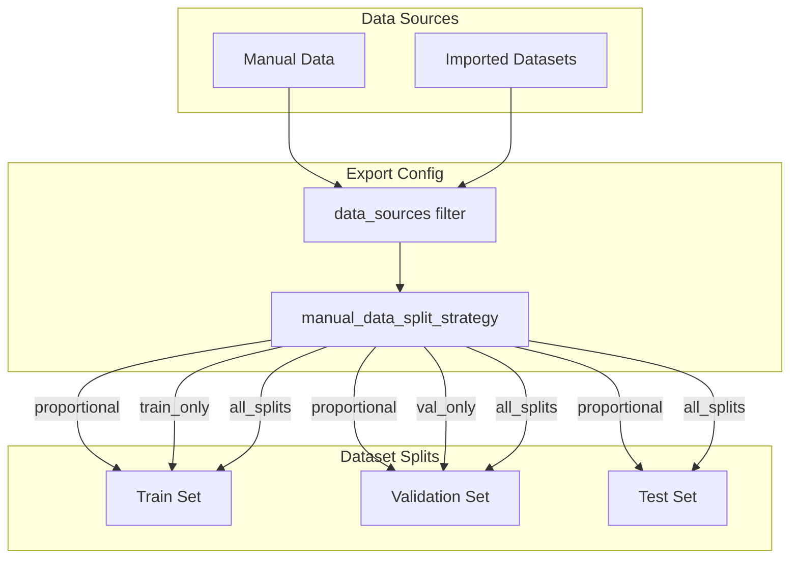

# Manual Data Training Integration

## Overview

Integrate manual data and imported datasets into the training workflow with explicit API controls. Video frames are removed as a training data source -- only **manual data** and **imports** are valid sources.

## Current State

- Manual data: `data/projects/{name}/manual_data/` with metadata in `frames/manual_data/frames.json`
- Imported datasets: `frames/{source_key}/frames.json` (e.g., `roboflow_crane-hook_1`, `coco_zoo_person_1`)
- Video frames: `frames/{video_id}/frames.json` where `video_id` is in `videos.json`
- All annotations shared in `labels/current/annotations.json`

Currently the export pipeline ([backend/app/api/training.py](backend/app/api/training.py) lines 82-100) iterates **all** `frames/` subdirectories indiscriminately, including video frames. This must change to explicitly exclude video frames and only include manual data and imports.

## Plan

### Step 1: Backend Models

Update [backend/app/models/training.py](backend/app/models/training.py) `DatasetExportConfig`:

```python
class DatasetExportConfig(BaseModel):
    format: Literal["yolo", "coco", "both"] = "both"
    include_unapproved: bool = False
    split_by_video: bool = True
    data_sources: list[Literal["manual_data", "imports"]] | None = None
    # None = include both manual_data and imports (default)
    # Explicit list = only include selected sources
    manual_data_split_strategy: Literal[
        "proportional", "val_only", "train_only", "all_splits"
    ] = "proportional"
    # proportional: distribute manual data across splits same as other data
    # val_only: all manual data goes to validation set only
    # train_only: all manual data goes to training set only
    # all_splits: manual data duplicated into all splits
```

### Step 2: Backend Export API

Update [backend/app/api/training.py](backend/app/api/training.py) `export_dataset` (lines 82-100):

- Load `videos.json` to identify video directories
- Categorize each `frames/` subdirectory:
  - `manual_data` directory -> source `"manual_data"`
  - Directory name in `videos.json` -> **skip entirely** (video frames removed)
  - Everything else -> source `"imports"`
- Filter by `config.data_sources` (default: include both)
- Pass source tags through to the exporter so it knows which frames are manual

### Step 3: Dataset Exporter Split Strategy

Update [backend/app/services/dataset_exporter.py](backend/app/services/dataset_exporter.py):

- Accept a `manual_data_split_strategy` parameter
- Before the main split logic, separate frames into `manual_frames` (video_id == "manual_data") and `other_frames`
- Apply split strategy:
  - `"proportional"`: merge manual frames back in, split everything together (current behavior)
  - `"val_only"`: all manual frames go to val split; only other frames get train/val/test split
  - `"train_only"`: all manual frames go to train split; only other frames get split
  - `"all_splits"`: manual frames are duplicated into every split (train + val + test)

### Step 4: CLI Training Path

Update [src/core/trainer.py](src/core/trainer.py):

- `load_project_data`: add a `sources` parameter (`list[str] | None`). When set, categorize directories the same way as the backend and filter. Always exclude video frame directories.
- `prepare_coco_dataset`: accept `sources` and `manual_data_split_strategy` parameters, pass them through
- Update [cli/train.py](cli/train.py): add `--sources` and `--manual-split-strategy` CLI flags

### Step 5: Frontend Types and API Client

Update [frontend/src/types/index.ts](frontend/src/types/index.ts):

```typescript
interface DatasetExportConfig {
  format: "yolo" | "coco" | "both";
  include_unapproved: boolean;
  split_by_video: boolean;
  data_sources: ("manual_data" | "imports")[] | null;
  manual_data_split_strategy:
    | "proportional"
    | "val_only"
    | "train_only"
    | "all_splits";
}
```

Update [frontend/src/api/client.ts](frontend/src/api/client.ts): pass new fields when calling `exportDataset`.

### Step 6: Frontend Training Page UI

Update [frontend/src/pages/TrainingPage.tsx](frontend/src/pages/TrainingPage.tsx):

- Add a "Data Sources" section with two toggles:
  - **Manual Data** (checkbox, default on) -- only shown if project has manual data
  - **Imported Datasets** (checkbox, default on) -- only shown if project has imports
- Add a "Manual Data Strategy" dropdown (only visible when manual data toggle is on):
  - Proportional (default) -- "Distribute across all splits"
  - Validation Only -- "Use only for model evaluation"
  - Training Only -- "Use only for training"
  - All Splits -- "Include in every split"
- Wire these into the `exportDataset` call in `handleStartTraining`



### Step 7: Documentation

Update [docs/getting-started.md](docs/getting-started.md) and [docs/api/index.md](docs/api/index.md) with:

- New data source model (no video frames)
- Export config options
- Manual data split strategy explanations
- CLI flag documentation

## Files to Modify

- [backend/app/models/training.py](backend/app/models/training.py) -- new config fields
- [backend/app/api/training.py](backend/app/api/training.py) -- source filtering in `export_dataset`, skip video dirs
- [backend/app/services/dataset_exporter.py](backend/app/services/dataset_exporter.py) -- split strategy logic
- [src/core/trainer.py](src/core/trainer.py) -- `load_project_data` source filtering, `prepare_coco_dataset` strategy
- [cli/train.py](cli/train.py) -- new CLI flags
- [frontend/src/types/index.ts](frontend/src/types/index.ts) -- TypeScript types
- [frontend/src/api/client.ts](frontend/src/api/client.ts) -- pass new params
- [frontend/src/pages/TrainingPage.tsx](frontend/src/pages/TrainingPage.tsx) -- data source toggles + strategy dropdown
- [docs/getting-started.md](docs/getting-started.md) / [docs/api/index.md](docs/api/index.md) -- documentation
