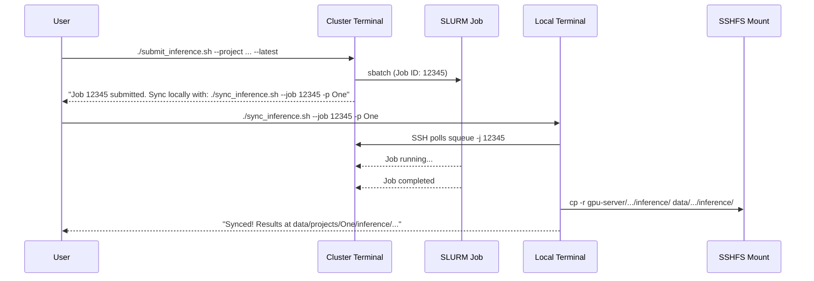

# Post-Inference Auto-Sync Hook

## Current Workflow (pain point)

1. User SSHes to GPU cluster, runs `./submit_inference.sh --project data/projects/One --latest`
2. SLURM job runs on compute node, writes results to `data/projects/One/inference/{run_name}/{video_id}/{timestamp}/` (detected.mp4, result.json)
3. User manually copies from SSHFS mount (`gpu-server/data/projects/One/inference/...`) to local (`data/projects/One/inference/...`)

## Design

Since `submit_inference.sh` runs **on the cluster** (requires `sbatch`), and the sync must happen **locally** (to copy from SSHFS mount), we need a local companion script. The approach:



## Changes

### 1. New script: `sync_inference.sh` (local-side)

This is the core of the feature. It:

- Takes `--job JOB_ID` and `--project PROJECT_PATH` (e.g., `data/projects/One` or just `One`)
- Verifies the SSHFS mount is available at `gpu-server/`
- Polls `squeue -j $JOB_ID -h` via SSH at a configurable interval (default 30s)
- When the job disappears from the queue, checks exit status via `sacct` if available
- Copies inference results from `gpu-server/{project}/inference/` to `{project}/inference/` using `cp -r`
- Only syncs new/changed files (compares timestamps or uses `cp -n` / `rsync --ignore-existing` from the mount)

Key details:

- SSH connection: reuse the same SSH host from [mount_gpu.sh](mount_gpu.sh) (`youngjin@xlogin.comp.nus.edu.sg`)
- Uses SSH ControlMaster (like [sync.sh](sync.sh)) for efficient polling without repeated password prompts
- Handles edge cases: mount not available, job already finished, job failed
- Only syncs the `inference/` subdirectory (not training data, frames, etc.)

### 2. Modify [submit_inference.sh](submit_inference.sh)

After job submission (line ~282-289), add a helpful message printing the exact `sync_inference.sh` command to run locally:

```
To auto-sync results locally when job completes:
  ./sync_inference.sh --job 12345 --project data/projects/One
```

This requires minimal changes -- just appending a few `echo` lines after the existing "Monitor with:" block.

### 3. Update docs

Update the mkdocs documentation to cover the new sync workflow.

## Considerations

- **Only inference results are synced**: The `inference/` subdirectory contains `detected.mp4` + `result.json` per run. Training checkpoints, frames, and labels are NOT synced (too large, not needed locally).
- **SSHFS mount must be active**: The script checks for the mount at `gpu-server/` and exits with a helpful error if not found, suggesting `./mount_gpu.sh`.
- **SSH auth**: Uses ControlMaster (like existing `sync.sh`) so polling doesn't require repeated password entry.
- **Large video files over SSHFS**: `cp` from SSHFS for ~15MB videos is fine. If bandwidth is a concern in the future, could add rsync-from-mount with progress.
- **Job failure detection**: After the job leaves the queue, optionally check `sacct -j $JOB_ID --format=State --noheader` to distinguish COMPLETED vs FAILED, and skip sync on failure.
- **Idempotent**: Running sync multiple times is safe -- it won't overwrite existing results (or can be configured to).
