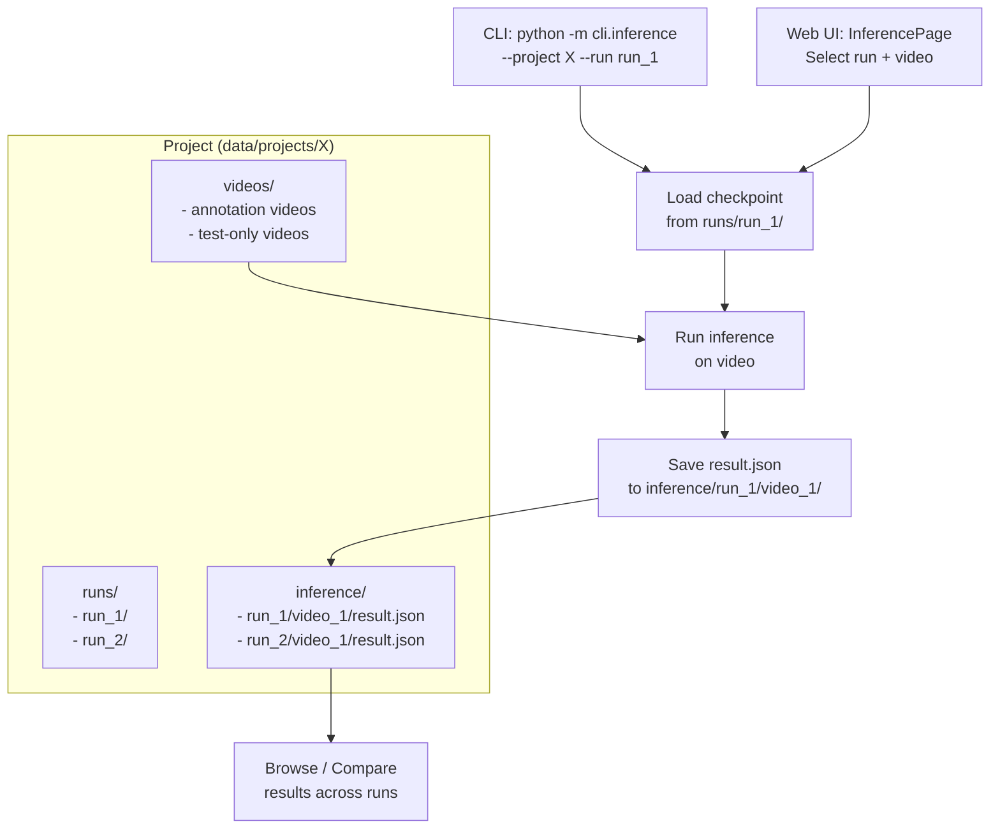

# Project-Centric Inference Architecture

## Current State

Today inference is disconnected from projects:

- **CLI** (`cli/inference.py`): Takes `--run` (from global `runs/` dir) + `--input` (arbitrary file path), saves to standalone `inference_results/`
- **Web UI** (`InferencePage.tsx`): Runs live inference but results are ephemeral -- not stored on disk, lost on page reload
- **No comparison**: No way to compare how different training runs perform on the same video

## Proposed Architecture

### Directory Structure

Add an `inference/` directory within each project, organized by run then video. This directory holds **only inference results** (detection outputs, annotated videos) -- not training artifacts. Training checkpoints, metrics, and configs remain in `runs/`. The `{run_name}` folder name under `inference/` is just an organizational reference to which training run produced the results.

```
data/projects/{ProjectName}/
├── project.json             # (updated: add inference_count)
├── videos/
│   └── videos.json          # (updated: add exclude_from_training flag)
├── runs/                    # Training artifacts (checkpoints, metrics, config)
│   ├── run_1/
│   │   ├── best.pth
│   │   ├── meta.json
│   │   └── ...
│   └── run_2/
│       └── ...
├── inference/               # NEW: Results only (no weights/training data)
│   ├── run_1/               # Results from run_1's model
│   │   ├── video_1/
│   │   │   ├── result.json       # config + stats + detections
│   │   │   └── detected.mp4      # annotated video (optional)
│   │   └── video_2/
│   │       └── result.json
│   └── run_2/               # Results from run_2's model
│       └── video_1/
│           └── result.json
├── frames/
├── labels/
└── ...
```

`result.json` contains everything in one file (config used, summary stats, per-frame detections) for simplicity. Example:

```json
{
  "run_name": "rfdetr_run_1",
  "video_id": "video_1",
  "created_at": "2026-02-20T...",
  "config": {
    "confidence_threshold": 0.5,
    "frame_interval": 1,
    "tracking": true,
    "tracking_mode": "visible_only"
  },
  "stats": {
    "total_frames": 300,
    "keyframes": 60,
    "total_detections": 1500,
    "avg_inference_time_ms": 45.2
  },
  "frames": [ ... ]
}
```

### Video Storage and Roles

All videos live in the same `{project}/videos/` directory -- there is no separate test video directory. Any video in the project can be used for inference, regardless of whether it's also used for annotation/training.

To distinguish test-only videos, add an `exclude_from_training` boolean to video metadata in `videos.json`. Default `false` for existing videos. When `true`, the video's frames won't be included in dataset exports, but it's still available for inference. When `false`, the video is used for both annotation/training and inference.

```json
{
  "video_1": {
    "filename": "training_clip.mp4",
    "exclude_from_training": false,
    ...
  },
  "video_2": {
    "filename": "test_clip.mp4",
    "exclude_from_training": true,
    ...
  }
}
```

The `--test-only` CLI flag and any UI filter use this flag to select a subset, but by default inference runs on **all** project videos.

---

## Changes by Layer

### 1. Core Project (`src/core/project.py`)

- Add `inference_dir` property: `self.path / "inference"`
- Add `inference/` to `Project.create()` directory initialization
- Add helper methods:
  - `list_inference_results()` -> dict mapping `(run_name, video_id)` to result metadata
  - `get_inference_result(run_name, video_id)` -> load `result.json`
  - `save_inference_result(run_name, video_id, data)` -> write `result.json`

### 2. Backend API (`backend/app/api/inference.py`)

Modify existing and add new endpoints:

- `**POST /run-on-video/{video_id}` (modify): After running inference, persist `result.json` to `{project}/inference/{run_name}/{video_id}/`. Return the result as before, plus a flag indicating it was saved.
- `**GET /inference/results` (new): List all persisted inference results as a matrix (runs x videos). Scans `{project}/inference/` directory. Returns enough for the frontend to render a grid.
- `**GET /inference/results/{run_name}/{video_id}` (new): Load a specific persisted result.
- `**DELETE /inference/results/{run_name}/{video_id}` (new): Delete a persisted result.
- `**POST /export-video/{video_id}` (modify): Save annotated video to `{project}/inference/{run_name}/{video_id}/detected.mp4` instead of `exports/`.

Add `exclude_from_training` support:

- `**PATCH /videos/{video_id}` or modify existing upload endpoint to accept the flag

### 3. CLI Inference (`cli/inference.py`) -- Rewrite

Remove standalone mode entirely. `--project` is now required. No more arbitrary `--input` file paths or saving to `inference_results/`.

- `--project` (required): Path to the project
- `--run` / `--latest`: Resolve from `{project}/runs/{run_name}/` only
- Without `--video`: Run on all project videos
- `--video video_2`: Run on a specific project video (by source_key)
- `--test-only`: Run only on videos marked `exclude_from_training: true`
- Results always saved to `{project}/inference/{run_name}/{video_id}/`
- Class names always loaded from project

Example usage:

```bash
# Run a project's training run on all its videos
python -m cli.inference --project data/projects/CraneHook --run rfdetr_run_1

# Run on a specific project video
python -m cli.inference --project data/projects/CraneHook --run rfdetr_run_1 \
    --video video_2

# Run on test-only videos
python -m cli.inference --project data/projects/CraneHook --run rfdetr_run_1 --test-only

# Use the latest training run
python -m cli.inference --project data/projects/CraneHook --latest
```

Remove: `--input`, `--output`, `--checkpoint`, `--classes` flags and the `RUNS_DIR` global constant. Remove `resolve_checkpoint()` standalone logic.

### 4. Training Runs Under Project (`cli/train.py`, `submit_train.sh`)

Currently CLI/SLURM training saves runs to a **global** `runs/` directory (e.g., `runs/rfdetr_h100_20260220_...`), while the web UI saves to `{project}/runs/`. This inconsistency means inference can't reliably find runs from the project.

Change the default so CLI/SLURM runs also save under the project:

- `cli/train.py`: Change `--output-dir` default from `runs/rfdetr_run` to `{project}/runs/rfdetr_run` (derived from `--project`)
- `submit_train.sh`: Change `OUTPUT_DIR` default from `runs/rfdetr_${GPU_TYPE}_${TIMESTAMP}` to `${PROJECT_DIR}/runs/rfdetr_${GPU_TYPE}_${TIMESTAMP}`
- Remove the global `RUNS_DIR` constant from `cli/inference.py` (already covered by the inference rewrite)

After this, all training interfaces (web UI, CLI, SLURM) produce runs under `{project}/runs/`, and inference can always find them there.

### 5. CLI Video Management (`cli/videos.py`) -- New

New CLI module for managing project videos from the command line. Reuses the same video metadata probing logic as the backend (`VideoProcessor.get_video_info`).

```bash
# Add a video to a project (copies into videos/, probes metadata, registers in videos.json)
python -m cli.videos add --project data/projects/CraneHook /path/to/video.mp4

# Add as test-only
python -m cli.videos add --project data/projects/CraneHook --test-only /path/to/video.mp4

# List videos in a project
python -m cli.videos list --project data/projects/CraneHook

# Remove a video
python -m cli.videos remove --project data/projects/CraneHook video_2
```

Internally this does the same thing as the web UI upload: copies the file to `{project}/videos/{video_id}_{filename}`, probes with ffmpeg/cv2, and writes to `videos.json`.

### 6. SLURM Scripts

- `submit_inference.sh`: Update to require `--project`, pass through new flags, remove standalone mode
- `submit_train.sh`: Default `OUTPUT_DIR` to `${PROJECT_DIR}/runs/...`

### 7. Frontend

#### InferencePage (`frontend/src/pages/InferencePage.tsx`) -- Redesign

Replace the current ephemeral flow with a persistent results view:

- **Results matrix**: Grid showing runs (rows) x videos (columns), with cells indicating whether inference has been run, and key stats (detection count, avg confidence) in each cell
- **Run inference action**: Select a run + video(s), configure settings, click "Run" -- results are persisted automatically
- **Result detail view**: Click a cell to see full results (video player with overlay, timeline, detection JSON)
- **Comparison mode** (stretch): Side-by-side view of two run results on the same video

#### ProjectPage (`frontend/src/pages/ProjectPage.tsx`)

- Add "test only" badge/toggle on video cards
- Add "Upload Test Video" option that sets `exclude_from_training: true`
- Add inference results summary section (e.g., "3 runs evaluated on 5 videos")

#### API Client (`frontend/src/api/client.ts`)

Add new methods:

- `inference.listResults(projectName)` -> matrix data
- `inference.getResult(projectName, runName, videoId)` -> single result
- `inference.deleteResult(projectName, runName, videoId)`

#### Types (`frontend/src/types/index.ts`)

Add `InferenceResultSummary`, `InferenceResultMatrix` types.

### 8. Documentation

Update the existing mkdocs pages:

- [docs/cli/inference.md](docs/cli/inference.md) -- new `--project` mode, `--test-only`, examples
- [docs/guides/inference.md](docs/guides/inference.md) -- rewrite around project-centric workflow
- [docs/scripts/submit-inference.md](docs/scripts/submit-inference.md) -- update SLURM examples

### 9. Consolidate Inference Engine

Currently there are three separate inference code paths:

- `cli/train.py --inference`: Uses `RFDETRTrainer.predict()` (image-only, no tracking)
- `cli/inference.py`: Uses `RFDETRInference` from `src/core/inference.py` (full video, ByteTrack, Kalman)
- Backend `InferenceRunner`: Uses its own implementation in `backend/app/services/inference_runner.py` with a custom `Tracker` class

Consolidate to a single engine:

- `**src/core/inference.py` (`RFDETRInference`) becomes the one source of truth for all inference
- **Backend**: Refactor `InferenceRunner` to wrap `RFDETRInference` instead of reimplementing inference. Replace the custom `Tracker` from `backend/app/services/tracker.py` with the ByteTrack tracking from `src/core/inference.py`
- **CLI train**: Remove the `--inference` flag from `cli/train.py` entirely (redundant now that `cli/inference.py` is the dedicated tool)
- This ensures CLI and web UI produce identical results on the same video with the same config

### 10. Standardize Checkpoint Search and Class Info

**Checkpoint search** -- Use one canonical order everywhere:

1. `checkpoint_best_total.pth`
2. `checkpoint_best_ema.pth`
3. `checkpoint_best_regular.pth`
4. `best.pth`
5. `checkpoint.pth`
6. Fallback: newest `.pth` file

Apply this order in `cli/inference.py`, `src/core/trainer.py`, and `experiments/train_experiment.py`.

`**class_info.json` -- Always save it during training, from all interfaces:

- `cli/train.py`: Already saves it (no change)
- Backend `training.py`: Add `class_info.json` save after training completes
- `experiments/train_experiment.py`: Already saves it (no change)

At inference time, load class names from `class_info.json` in the run directory (authoritative for that checkpoint), with fallback to the project's class list.

### 11. Dataset Export Under Project

Move CLI dataset export to be project-relative, matching the backend:

- `cli/train.py`: Change `--output-dataset` default from `datasets/rfdetr_coco` to `{project}/exports/coco`
- `submit_train.sh`: Change `OUTPUT_DATASET` default from `datasets/rfdetr_coco` to `${PROJECT_DIR}/exports/coco`

### 12. Dataset Export Guard Rail

Verify that the dataset export logic in both `backend/app/api/training.py` and `cli/train.py` respects `exclude_from_training` so test-only video frames are never included in training datasets.

---

## Data Flow



## Migration

- Existing projects: No migration needed. The `inference/` directory is created on first use.
- Existing `videos.json` entries: Treated as `exclude_from_training: false` by default (no migration needed).
- **Breaking change**: The CLI no longer supports standalone mode. All inference must go through a project. Users who previously ran `python -m cli.inference --checkpoint model.pth --input video.mp4` must now use `--project` + `--run`.
