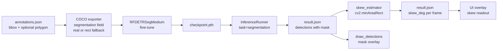

## Scope (locked by user)

- Scope **A**: one seg model, real polygons only for `spreader` + `container`, rectangular-fallback polygons for every other class at COCO export time.
- **Include skew**: compute `skew_deg` from masks, persist in `result.json`, add a simple overlay.

Non-goals: no segmentation UI for classes other than spreader/container, no retraining of existing detection runs, no change to YOLO path.

## Architecture at a glance



## Model loading (bucket 1)

Refactor the 3 duplicated dispatchers to take a `task: "detection" | "segmentation"` argument:

- [src/core/trainer.py](src/core/trainer.py) `_load_rfdetr_model()` at line 966 and `RFDETRTrainer._load_model()` at line 806.
- [backend/app/services/inference_runner.py](backend/app/services/inference_runner.py) `_load_rfdetr_model()` at line 28.

Replace the size-only dispatch with a `(task, size)` table mapping to class names in `rfdetr` (`RFDETRBase/Medium/Large` for detection, `RFDETRSegNano/Small/Medium/Large/XLarge` for segmentation). `RFDETRTrainer.__init__` gains `task="detection"` default. Thread through from `TrainingConfig` and the training/inference API payloads.

Update the resolution rule at [.cursor/rules/rfdetr-resolution.mdc](.cursor/rules/rfdetr-resolution.mdc) to document Seg native input sizes (312, 384, 432, 504, 624, 768). Seg classes don't need `image_size` rounding — use each class's native resolution.

Note: there is no `RFDETRSegBase`. Default seg model size is `medium` (432px).

## Annotation schema (bucket 2)

Extend the stored annotation in the project's `labels/current/annotations.json` to optionally carry a polygon:

```jsonc
{
  "frame_id": "...",
  "class_label_id": 3,
  "x": 0.5, "y": 0.4, "width": 0.3, "height": 0.2,  // unchanged
  "polygon": [[0.42, 0.35], [0.58, 0.34], ...]      // new, optional, normalised [0,1]
}
```

- Backward compatible: existing annotations without `polygon` stay valid detection annotations.
- Write path: [backend/app/api/annotations.py](backend/app/api/annotations.py) accepts optional `polygon`.
- Labelling UI: hook SAM3 at [backend/app/services/sam_labeler.py](backend/app/services/sam_labeler.py) to produce a polygon from a click; store it alongside the bbox for `spreader`/`container` only. All other classes stay bbox-only.

## COCO export with segmentation (bucket 3)

Both exporters currently emit only `bbox` + `area`. Add a `segmentation` field:

- [src/core/trainer.py](src/core/trainer.py) `create_coco_split()` at line 398.
- [backend/app/services/dataset_exporter.py](backend/app/services/dataset_exporter.py) annotation loop around line 319.

Logic per annotation:

```python
if ann.get("polygon"):
    poly_px = [[x * img_w, y * img_h] for x, y in ann["polygon"]]
    segmentation = [[v for pt in poly_px for v in pt]]  # COCO flat format
else:
    # rectangular fallback from bbox (4 corners, flat)
    segmentation = [[x_min, y_min, x_max, y_min, x_max, y_max, x_min, y_max]]
coco_ann["segmentation"] = segmentation
```

This lets seg training work on the whole dataset without re-labelling everything, while still learning tight masks on `spreader` and `container` from their real polygons.

## Inference: carry masks through (bucket 4)

- Add `mask: list[list[float]] | None = None` to `Detection` at [src/core/inference.py](src/core/inference.py) line 24, and include it in `save_results_json`'s per-detection dict at line 575.
- In `InferenceRunner._parse_rfdetr_results` at [backend/app/services/inference_runner.py](backend/app/services/inference_runner.py) line 461, when `results.mask` is present, extract the largest contour with `cv2.findContours`, downsample with `cv2.approxPolyDP(..., epsilon=1.5)` to keep polygons small, normalise to `[0, 1]`, and attach as `mask` on the emitted dict.
- Extend `draw_detections` at [src/core/inference.py](src/core/inference.py) line 501 to render the polygon (semi-transparent fill + outline) when present.

## Skew estimator (bucket 5)

New module `backend/app/services/skew_estimator.py`:

```python
def orientation_deg(polygon_norm, img_w, img_h) -> float:
    pts = np.array([[x * img_w, y * img_h] for x, y in polygon_norm], np.float32)
    (_, _), (w, h), angle = cv2.minAreaRect(pts)
    if w < h:
        angle += 90.0
    return ((angle + 90.0) % 180.0) - 90.0

def compute_skew(result_json_path: Path) -> None:
    # for each frame with both a spreader and a container detection,
    # compute skew_deg = wrap(orientation(container) - orientation(spreader))
    # write frame["skew_deg"] into the persisted result.json
```

Wire it in after inference completes, symmetric to how `z_estimator.apply_z_to_result` runs today. Add a `skew` block to `result.json` at the top level for metadata (pair rule used, number of frames with skew, etc.).

## API + UI (bucket 6)

- Training API: accept `task` in the training run config at [backend/app/api/training.py](backend/app/api/training.py); persist on the run record so inference knows how to load the checkpoint.
- Inference API: `task` is read from the run's metadata; no new query param needed.
- Frontend: a task toggle on the training page ("Detection" / "Segmentation"); a new `skew_deg` read-out in the inference overlay (mirrors `z_mm`). The existing Z-calibration warning at [docs/guides/z-axis-height-estimation.md](docs/guides/z-axis-height-estimation.md) line 262 gets a follow-up note: if masks are available, `s` is taken from `minAreaRect`'s short side, which makes Z-calibration skew-robust (stretch goal — can defer to a separate plan).

## Docs

- Update [.cursor/rules/rfdetr-resolution.mdc](.cursor/rules/rfdetr-resolution.mdc) with the Seg variants and their native resolutions.
- New guide `docs/guides/segmentation-and-skew.md` summarising the pipeline, schema, and the `orientation_deg` math (can lift directly from the earlier chat explanation).

## Rollout

1. Land buckets 1 + 3 + 4 behind a `task` flag, default still `detection`. No behaviour change for existing runs.
2. Spike: run a pretrained `RFDETRSegMedium()` (no retraining) on a sample video to validate the mask plumbing end-to-end and sanity-check `skew_deg` values.
3. Label polygons on spreader + container across ~200 representative frames using SAM3 (bucket 2).
4. Fine-tune seg model on the extended dataset.
5. Land bucket 5 + 6. Ship.