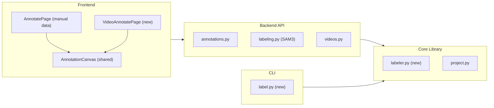

# Video Frame Annotation, SAM3 UI Integration, and Bounding Box UX

## Architecture Overview

Three major workstreams, all sharing a refactored annotation canvas component:




---

## 1. Shared Annotation Canvas Component

Extract the bounding box drawing/editing logic from [AnnotatePage.tsx](frontend/src/pages/AnnotatePage.tsx) into a reusable `AnnotationCanvas` component, then enhance the UX.

**New file**: `frontend/src/components/AnnotationCanvas.tsx`

**Props interface**:

- `imageUrl: string` -- image to display
- `imageWidth / imageHeight: number` -- natural dimensions
- `annotations: Annotation[]` -- current annotations for this frame
- `selectedAnnotationId: number | null`
- `selectedClassId: number`
- `classes: string[]`
- `onCreateAnnotation(box, classId)` / `onUpdateAnnotation(id, box)` / `onDeleteAnnotation(id)` / `onSelectAnnotation(id | null)`

**Bounding box UX improvements** (Label Studio parity):

- **8 resize handles**: 4 corners + 4 edge midpoints (currently only 4 corners)
- **Edge dragging**: grab any edge to resize one dimension
- **Crosshair guides**: draw light dashed lines at cursor position while in draw mode
- **Minimum box size**: enforce 5px minimum during draw/resize, discard tiny accidental clicks
- **Undo/redo**: Ctrl+Z / Ctrl+Shift+Z via a local action stack (create/move/resize/delete)
- **Keyboard**: existing shortcuts preserved + `Ctrl+A` select all, `Ctrl+D` duplicate
- **Better z-ordering**: click cycles through overlapping boxes (currently picks topmost)
- **Visual polish**: semi-transparent fill on hover (not just selected), dashed border while drawing

Both `AnnotatePage` (manual data) and the new `VideoAnnotatePage` will use this component.

---

## 2. Video Frame Annotation Page

**New route**: `/projects/:projectName/annotate/video/:videoId`

**New file**: `frontend/src/pages/VideoAnnotatePage.tsx`

Register in [App.tsx](frontend/src/App.tsx):

```tsx
<Route path="projects/:projectName/annotate/video/:videoId" element={<VideoAnnotatePage />} />
```

### UI Layout

```
+---------------------------------------------------------------+
| Back | Video: crane_hook.mp4 | [Interval v] [Annotated v] | SAM3 |
+---------------------------------------------------------------+
|                                                    | Classes  |
|                                                    |  - hook  |
|              [Annotation Canvas]                   |  - person|
|              (current frame)                       |          |
|                                                    | Regions  |
|                                                    |  - ...   |
+---------------------------------------------------------------+
| <<  <  Frame 42 / 300  >  >>    [annotated: 12/300]           |
| [  ] [  ] [*] [  ] [  ] [*] [  ] ...   (filmstrip)           |
+---------------------------------------------------------------+
```

### Filmstrip Viewing Modes

The filmstrip has **two mutually exclusive modes**, toggled via a segmented control in the toolbar:

1. **Interval mode** (default): Shows every Nth frame from the video (N configurable: 1, 2, 5, 10, 15, 30). Used for labeling new frames. Changing N re-grids the filmstrip; previously annotated frames that no longer fall on the grid are simply not shown in this mode.
2. **Annotated mode**: Shows **only** frames that have at least one annotation, regardless of what interval was active when they were labeled. Used for reviewing/editing existing labels. If no frames are annotated yet, shows an empty state with a hint to switch to Interval mode.

This keeps the filmstrip clean in both cases -- no mixing of pinned and interval frames -- and ensures you never lose access to annotated work.

**Key behaviors**:

- On load, extract frames if not already done (or use existing extracted frames)
- Filmstrip thumbnails: border color indicates annotation status (green = has annotations, amber = selected, grey = none)
- Clicking a frame navigates to it; arrow keys navigate within the current mode's frame list
- Uses the shared `AnnotationCanvas` for drawing/editing boxes
- Annotations are saved via the existing `POST /annotations` API with `frame_id = video_1_000042` etc.
- Above the filmstrip: counter showing "12 / 300 frames annotated" (always visible in both modes)

### Backend: Video frame serving for annotation

Currently `GET /{video_id}/frames` returns frame metadata and `GET /{video_id}/frame/{frame_number}` extracts a single frame on-the-fly. For the annotation page we need:

- **New endpoint** `GET /projects/{project_name}/videos/{video_id}/frames/{frame_id}/image` that serves the pre-extracted JPEG from disk (already at `frames/{video_id}/{frame_id}.jpg`). This is more efficient than re-extracting.
- Add `annotation_count` to each frame in the `list_frames` response by cross-referencing `annotations.json`.
- **New API client method**: `api.videos.frameImageUrl(projectName, videoId, frameId)` returning the URL.

### ProjectPage changes

In [ProjectPage.tsx](frontend/src/pages/ProjectPage.tsx), the video card's "Annotate" button (line ~428) currently links to `/projects/${projectName}/annotate` (manual data). Change it to link to `/projects/${projectName}/annotate/video/${v.id}`. Also display `annotation_count` on each video card (already returned by the API).

After visiting the video annotation page, the project page should show a summary: "12 frames annotated" alongside the existing video metadata.

---

## 3. SAM3 Auto-Label Integration in Annotation UI

### 3a. Class Descriptions for SAM3

**Project config change**: Add `class_descriptions: Record<string, string>` to `project.json` and `ProjectConfig`.

Example:

```json
{
  "classes": ["crane_hook", "person"],
  "class_descriptions": {
    "crane_hook": "A metal crane hook, typically yellow or black, suspended from a cable",
    "person": "A construction worker wearing a hard hat and safety vest"
  }
}
```

**Backend** ([projects.py](backend/app/api/projects.py)):

- New endpoint: `PUT /projects/{project_name}/class-descriptions` accepts `dict[str, str]`
- SAM3 labeler uses `class_descriptions.get(class_name, class_name)` as the text prompt

**Core** ([project.py](src/core/project.py)):

- Add `class_descriptions: dict[str, str]` field to `ProjectConfig` / `Project`
- `save()` / `load()` persist it

**Frontend types** ([types/index.ts](frontend/src/types/index.ts)):

- Add `class_descriptions?: Record<string, string>` to `Project` or `ProjectConfig`

**Frontend API client** ([client.ts](frontend/src/api/client.ts)):

- New method: `api.projects.updateClassDescriptions(name, descriptions)`

### 3b. SAM3 Button in Annotation UI

**For manual data** (`AnnotatePage`):

- Toolbar button: "Auto-label with SAM3" (wand icon)
- Click triggers auto-labeling on **all images** in the current dataset
- Shows a modal with:
  - Class descriptions editor (per-class textarea, pre-filled with class name)
  - Confidence threshold slider (default 0.25)
  - Checkbox: "Skip already-labeled images" (default true)
  - "Run" button starts the background job
- Progress bar shown in-page while running
- On completion, re-fetches annotations for current frame

**For video annotation** (`VideoAnnotatePage`):

- Same toolbar button, but shows a frame selection UI:
  - "Select frames to auto-label": checkboxes or range selector
  - Options: "All visible frames", "Selected frames only", "Unlabeled frames only"
  - Same class description editor and confidence threshold
- Sends `frame_ids` list to the auto-label API

**Backend** ([labeling.py](backend/app/api/labeling.py)):

- Extend `AutoLabelRequest` with `class_descriptions: dict[str, str] | None = None`
- In `_run_auto_labeling`, use `class_descriptions.get(cls, cls)` as prompts instead of raw class names
- Add `source_keys: list[str] | None = None` to filter by source (e.g., `manual_data`, `manual_data__dataset_name`)

**SAM labeler** ([sam_labeler.py](backend/app/services/sam_labeler.py)):

- `label_frame()` already accepts `class_prompts: list[str]` -- just pass the descriptions instead of raw names

### 3c. Core/CLI SAM3 Labeling (Feature Parity)

**New core module**: `src/core/labeler.py`

- `SAMLabeler` class wrapping the SAM3 model (mirrors `backend/app/services/sam_labeler.py`)
- `auto_label_frames(project, frame_ids, class_descriptions, confidence, skip_labeled)` -- works on a Project object
- Returns list of created annotations
- Handles loading/saving annotations via `Project.load_annotations()` / `Project.save_annotations()`

**New CLI command**: `cli/label.py`

- `python -m cli.label --project <name> [--video <video_id>] [--source manual_data] [--frames 0,5,10] [--descriptions '{"crane_hook": "yellow metal hook"}'] [--confidence 0.25] [--skip-labeled]`
- Uses `src/core/labeler.py`
- Prints progress and summary

**Documentation**: Update [docs/cli/](docs/cli/) and [docs/guides/](docs/guides/) with new CLI command and annotation workflow docs.

---

## 4. Backend API Changes Summary


| Endpoint                                         | Change                                         |
| ------------------------------------------------ | ---------------------------------------------- |
| `GET /videos/{video_id}/frames`                  | Add `annotation_count` per frame               |
| `GET /videos/{video_id}/frames/{frame_id}/image` | **New** -- serve extracted frame JPEG          |
| `PUT /projects/{name}/class-descriptions`        | **New** -- update class descriptions           |
| `POST /labeling/auto-label`                      | Add `class_descriptions`, `source_keys` fields |


---

## 5. Files Changed (Summary)

**New files**:

- `frontend/src/components/AnnotationCanvas.tsx` -- shared annotation canvas
- `frontend/src/pages/VideoAnnotatePage.tsx` -- video frame annotation page
- `src/core/labeler.py` -- SAM3 labeling core module
- `cli/label.py` -- SAM3 labeling CLI

**Modified files**:

- `frontend/src/App.tsx` -- add video annotation route
- `frontend/src/pages/AnnotatePage.tsx` -- refactor to use shared canvas, add SAM3 button
- `frontend/src/pages/ProjectPage.tsx` -- video annotate button links to video annotation page
- `frontend/src/types/index.ts` -- add class_descriptions, video frame annotation types
- `frontend/src/api/client.ts` -- add new API methods
- `backend/app/api/videos.py` -- frame image endpoint, annotation counts on frames
- `backend/app/api/labeling.py` -- class descriptions in auto-label request
- `backend/app/api/projects.py` -- class descriptions endpoint
- `backend/app/services/sam_labeler.py` -- use descriptions as prompts
- `backend/app/main.py` -- no changes needed (routers already registered)
- `src/core/project.py` -- class_descriptions field
- `docs/guides/training.md` -- update with annotation workflow
- `docs/cli/train.md` -- document new label CLI command

